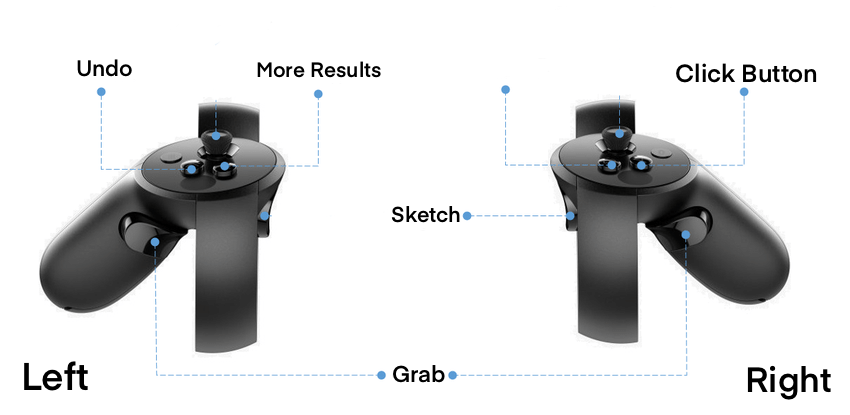

This project contains the code used for the Sketch into Metaverse demo presented at AIUK2023. Please refer to [the demo video](https://www.youtube.com/watch?v=bwabdXnS-Zo&t=73s&ab_channel=LingLuo) for the scene after running the demo.

Platform:

- Windows: Unity + Visual Studio Code
- Oculus Rift: 1 headset + 2 hand controllers

The demo project consists of two parts: 
1. `retrieval_inference`: Backend inference code based on Python 
2. `Sketch_VR`: VR interface using Unity

To run the demo:
# Step 1: retrieval_inference

Open `retrieval_inference` in Visual Studio Code. 
Create your own conda environment, then install the necessary pacckages by running:
```shell
pip install -r requirements.txt
```
Run `main.py` from `retrieval_inference`.

# Step 2: Sketch_VR_demo

First, set up the Oculus environment and ensure it is functioning properly.

Second, download [the chair object files]() and unzip the downloaded `ShapeNetCore.v2.zip` under the current `Sketch_VR_demo` directory.

If you want to run the demo directly, you can download [the executable file](https://drive.google.com/file/d/1eu6ajkRmwHDkoizROvMMcdXolq6iIkhc/view?usp=sharing) and extract the downloaded `game.zip` into the current `Sketch_VR_demo` directory. Then start the game by running `VR Sketch.exe`

The correct directory hierarchy structure is as follows:

```
- retrieval_inference
- Sketch_VR_demo
    - game
        - VR Sketch.exe: The executable file of this game.
        - ...
    - ShapeNetCore.v2
        - 03001627: chair category of ShapeNetCore.v2 dataset
    - demo_savedir: The location where the VR sketch is saved.
    - Sketch_VR: The code repository for Unity game development.
    - ...
```

If you want to continue editing this demo, please open the current `Sketch_VR` __subdirectory__ in Unity.

The controller operation guide is shown in the following figure.




